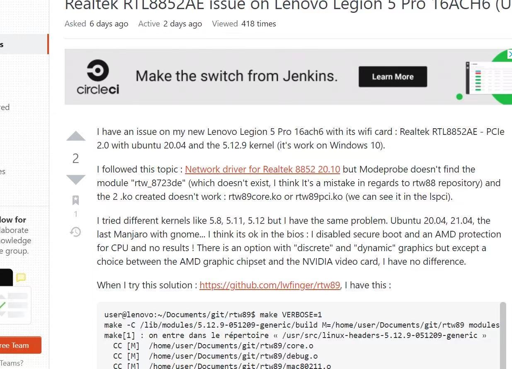
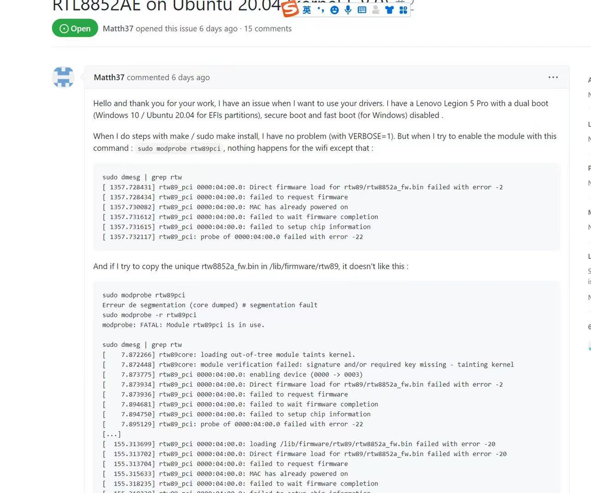
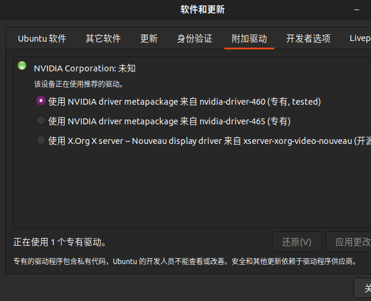
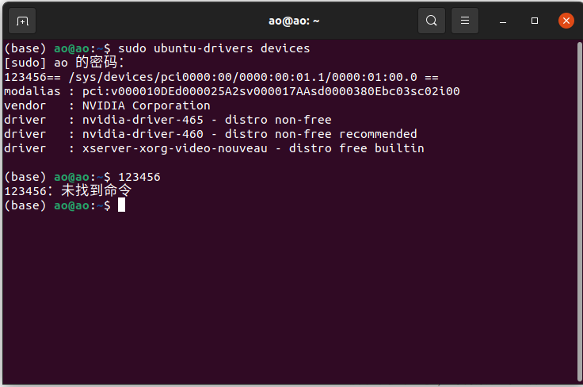
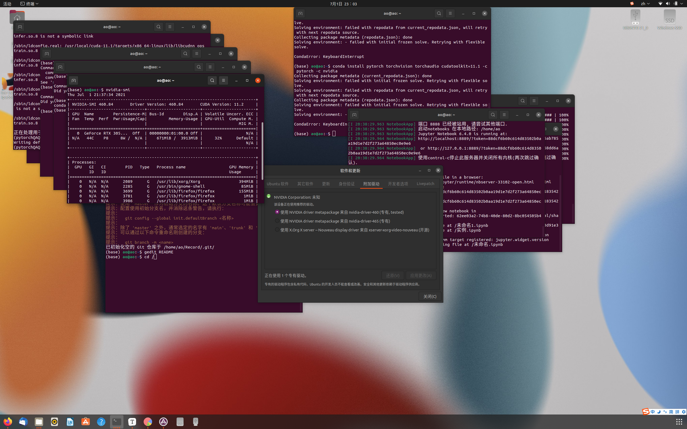

## ubuntu windows双系统搭建之旅

#### 前言

研究生开学要从事一些深度学习方面的研究，以前经历过Windows系统CUDA安装的痛苦，所以我暗搓搓希望装一台Linux系统，正好在毕业前夕买了一台带有显卡的Laptop，这也是噩梦开始的地方(⊙o⊙)，之前装过虚拟机，跑过相应实验比如MQTT物联网开发的实验(忘记不少了QAQ会学的)

#### 准备的工具

- 一个作为启动的光盘
- 一个敢于折腾的心
- 足够快的网络
- 知乎CSDN等等相关网络工具

#### 安装目录

下面就是我在这整个期间安装的全部软件啦,虽然没大佬们的那么熟练，但也是第一次完整安装下来

- Ubuntu双系统21.04
- Git安装
- 搜狗输入安装
- nvidia驱动安装
- 
- anaconda3安装
- cuda
- cudnn
- pytorch
- clion
- pycharm
- typora
- git

#### 双系统安装

 本次安装的laptop，是联想小新Pro 16+512G版本(好像都是的，显卡是RTX3050，无线网卡是瑞昱的RTL8852AE版本的无线网卡，本次选用的Linux发行版是Ubuntu21.04，之所以未使用LTS版本是因为在上述版本中，亮度和声音调节不可用，(ˉ▽￣～) 系统一直处于高速运转的状态中，风扇转的好快。

对于系统安装，主要就是以下几个点^(*￣(oo)￣)^

- 首先你要去Ubuntu官网下载对应版本的iso文件(偷偷告诉你国内各个镜像网站也是可以哒)

- 利用Rufux制作系统U盘(一定要买一个读写速度快一些哒n(*≧▽≦*)n)，现在的电脑一般是UEFI引导，legacy很少用了，所以在下面的系统分区中会用得到。下载好软件后，GPT格式写入U盘，这个时候要注意U盘此时会被格式化哦。

- 接着就是系统分区了,下面是整体的分布情况,可以使用DiskGenius软件或者系统自身磁盘管理(在Windows下面)，这个可以去找找其他人，应该很简答哒，注意不要误删Windows的系统文件和注意备份

  

- Bios设置，ctrl+fn+f2,进入BIOS系统，在这一步我们需要禁用Fast boot 和 security boot即两个安全设置，注意在禁用security,重启电脑后会触发Windows自带的Bitlocker恢复，输入此驱动器的恢复秘钥，这个用其他电脑或者手机输入,[恢复链接](https://acount.microsoft.com/devices/recoverykey),一定要注意激活Windows时注册的账号和密码等等，输入后Windows也可正常进入。

- 安装系统，ctrl+fn+f12我们会进入grub中，这里应该会有两种引导方式，windows boot manager 还有你的U盘名字(比如是闪迪u盘就是sandisk，金士顿的u盘就是kingston,我们选择从u盘进入。

- 接下来就是一些基础设置，设置语言选英文(后面可以自己改哈),键盘布局，无线网络

  #### 下面就是前面遇到的最大的坑点之一-网络的问题

  






瑞昱网卡的问题，在ubuntu20.04无法找到wifi和蓝牙，如果调用网络net-tools中ifconfig，ping等等相关命令，必须先连接网络，所以我选择连接以太网连接对应的网络，这个是时候我连好了我的手机的USB端口，打开了对应的热点。结果，以太网连接不上，这个时候我意识到了可能Ubuntu没有内置对应瑞昱网卡的驱动，摆在我面前的只有两条路，一是等待大佬的issue完美解决，二是更换网卡。我深知自己的代码能力的欠缺，所以我选择了最省事的一种，换网卡。

#### 更换网卡

网卡选择的型号是fenvi的ax200，也是牙膏厂出的WiFi6，因为是AMD的本子，ax200系列最高支持到200(真有你的牙膏厂),这个时候就是等待快递发货的日子，期间去杭州玩了一趟，又过了个毕业典礼，618期间联想有个4选一的活动，预约的硬件加装服务,安装过程挺简单，就是如何将大象装进冰箱三步。

- 接下来的安装方式，最小安装或者正常安装都可以O(∩_∩)O哈！，最底下的那个不要选，接下来我们手动安装对应的驱动

- Next是安装类型，第一个是安装Ubuntu可以和其他系统共存，第二个是清除整个系统(就是n(*≧▽≦*)nWindows没有啦),我们要选择第三个，something else

- 接下来是系统分区，上面已经提过了大致的分区方式，要在freespace上点击加号进行分区的划分

  | 分区名字 | 分区文件类型 | 分区大小 | 分区类型 |
  | -------- | ------------ | -------- | -------- |
  | /        | ext4         | 50G      | 主分区   |
  | /swap    | 交换空间     | 16G      | 逻辑分区 |
  | /home    | ext4         | 剩下的   | 主分区   |

  这种分配方式未设置/boot，因为Windows系统已经有efi格式的分区，Linux和Windows共用，所以设置引导器的设置也就是对应的efi分区，后面是windows boot manager

- 选择时区shangha，姓名和计算机名我都设置一样~\(≧▽≦)/~啦啦啦，密码就不告诉你了
- 接下来就下一步，等待系统的重启

### 显卡驱动安装

下一步操作之前，我们先需要明白以下的知识。几乎所有的Ubuntu内置的驱动都是nouveau的内置驱动，开源(ˉ▽￣～) ，但是对于我可能不太适合因为我需要cuda等深度学习开发的工具。所以安装一个必要驱动还是挺必要的。



驱动的安装参考了很多种的方法，有runfile的，deb或者命令行安装，以下几种



通过自带的命令，接着选择对应的驱动安装，或者去英伟达官网选择对应的版本进行安装runfile，需要自己手动，网上相关的教程很多.下面我们首先进行一个开源驱动的禁止.

```
sudo gedit /etc/modprobe.d/blacklist.conf
```

在这个文件上添加如下的两行，不要关闭终端

```
blacklist nouveau
options nouveau modeset=0
```

```
sudo update-initramfs -u
sudo reboot
```

输入两条命令之后，系统会修改原来的文件并重启,这个时候进入系统是没有问题的.

接下来，是我遇到比较久的问题，其实也比较好解决，如果直接添加驱动后，系统重启之后，就会卡在系统logo上无法进入，这时restart进入ubuntu advanced options 分别修复grub和resume，有较小的概率会重新进入,根源就是未卸载原有的驱动，所以下面我们的做法是删除原有的旧驱动。

```
sudo apt-get purge nvidia*
```

然后打开软件更新中附加驱动，查看上面命令中的推荐的驱动应用更改然后重启，重启之后会进入一个左上角是白色光标闪烁，这个时候切换到tty2，输入login以及passwd,然后切换到tty1，就可得到正常的图像的页面。

```
nvidia-smi
```

检查驱动版本和CUDA版本，然后就可以看到你想要的界面了。


